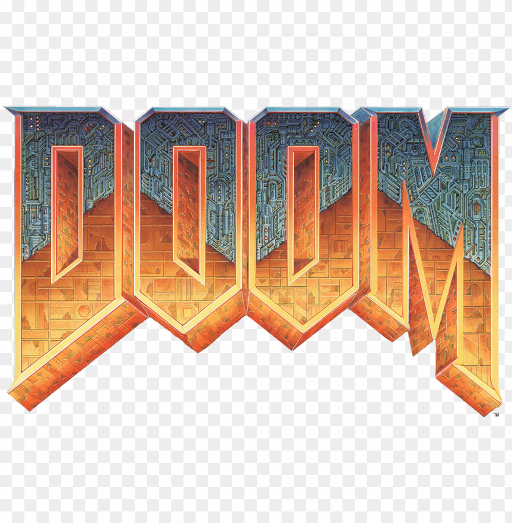

# DOOM Remake

A modern remake of the classic DOOM game, built using Raylib and C. This project brings the iconic first-person shooter to life with 3D graphics, shooting mechanics, and enemy interactions.



## Features

- First-person 3D gameplay
- Shooting mechanics with bullet physics
- Enemy AI and interactions
- Title screen and credits
- Modern graphics using Raylib
- Collision detection system
- Score tracking system

## Prerequisites

- C compiler (GCC recommended)
- Raylib library
- Basic understanding of 3D graphics programming

## Installation

1. Clone the repository:
```bash
git clone https://github.com/yourusername/doom-remake.git
cd doom-remake
```

2. Install Raylib dependencies:
- Windows: Follow the [Raylib installation guide](https://github.com/raysan5/raylib/wiki/Installation-Guide)
- Linux: `sudo apt-get install libraylib-dev`
- macOS: `brew install raylib`

3. Compile the project:
```bash
gcc Doom_main.c -o doom -lraylib -lopengl32 -lgdi32 -lwinmm
```

## Project Structure

- `Doom_main.c`: Main game logic and entry point
- `3d_camera.c`: Camera controls and 3D view implementation
- `shooting.c`: Shooting mechanics and bullet physics
- `title_screen.c`: Title screen implementation
- `resources/`: Game assets and textures
- `fonts/`: Custom fonts used in the game

## Controls

- WASD: Movement
- Mouse: Look around
- Left Click: Shoot
- ESC: Exit game

## Gameplay

The game features:
- First-person perspective
- Shooting mechanics with bullet physics
- Enemy encounters
- Score tracking
- Multiple game states (Title Screen, Main Game, Credits)

## Contributing

Contributions are welcome! Please feel free to submit a Pull Request.

## License

This project is licensed under the MIT License - see the LICENSE file for details.

## Acknowledgments

- Original DOOM by id Software
- Raylib library and community
- All contributors and supporters

## Author

Syed Abrar Shah
Hashir Ali Butt

## Version

1.0.0 
